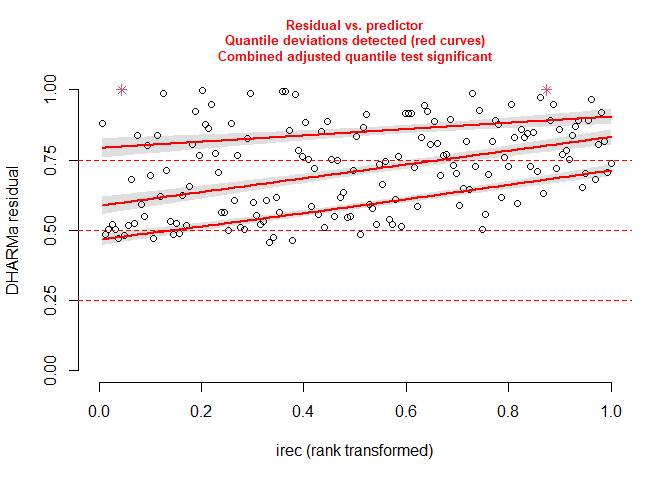
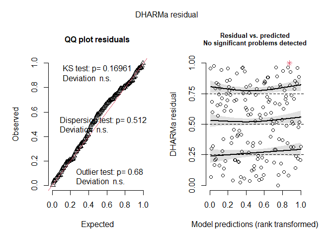

Irec and creel data exploration
================
Catarina Wor
December 2022

# Steps

- Reproduce current simple model
- compare with updated version including area

The original model is given by:

$$
Creel_i =  \beta_1\cdot z_i + \epsilon_i
$$ $$
z_i = iREC_i   + \nu_{i} 
$$

$$
\epsilon_i \sim N(0,\sigma_{\epsilon})
$$ $$
&\nu_{i} \sim N(0,\sigma_{\nu})
$$

This model is run individually for each year, and disposition
(kept/released). In the initial runs of this project, I thought of
grouping all the years as replicates, however that would mean that the
catch estimates for year Y would change every time the calibration is
re-run, which is not ideal and may cause a lot of confusion.

So I am reproducing the analysis (kind of), by year. Using year 2019 as
an example here

## Reproduce default model

This is an attempt to reproduce the original model using glmmTMB - So I
can compare it with the model with area as a covariate. The original
code is written in JAGS, and takes into account the known sd of the
observed irec estimates. – I am not sure of how to reproduce that in
glmmTMB, so I crated a dummy variable for each observation.

``` r
m <- glmmTMB(creel ~ 0+ (0+irec|dum),
             data = dat_pos)
summary(m)
```

    ##  Family: gaussian  ( identity )
    ## Formula:          creel ~ 0 + (0 + irec | dum)
    ## Data: dat_pos
    ## 
    ##      AIC      BIC   logLik deviance df.resid 
    ##   2643.0   2649.1  -1319.5   2639.0      157 
    ## 
    ## Random effects:
    ## 
    ## Conditional model:
    ##  Groups   Name Variance  Std.Dev.
    ##  dum      irec    0.8598  0.9273 
    ##  Residual      8029.8669 89.6095 
    ## Number of obs: 159, groups:  dum, 159
    ## 
    ## Dispersion estimate for gaussian family (sigma^2): 8.03e+03

``` r
#diagnostics
bm <- DHARMa::simulateResiduals(m, n = 1000)
plotResiduals(bm, form = dat_pos$irec)
```

<!-- -->

## Updated method

This update is based on Sean’s previous work on the explore.R file. To
my suprise, the best model still performs well when the data is split by
year.

``` r
dat_pos$log_irec <- log(dat_pos$irec) 

m1.2 <- glmmTMB(creel ~ 1 + log_irec +  (1 + log_irec | region), 
                data = dat_pos, family = nbinom1(), dispformula = ~log_irec)

summary(m1.2)
```

    ##  Family: nbinom1  ( log )
    ## Formula:          creel ~ 1 + log_irec + (1 + log_irec | region)
    ## Dispersion:             ~log_irec
    ## Data: dat_pos
    ## 
    ##      AIC      BIC   logLik deviance df.resid 
    ##   2293.5   2315.0  -1139.8   2279.5      152 
    ## 
    ## Random effects:
    ## 
    ## Conditional model:
    ##  Groups Name        Variance Std.Dev. Corr  
    ##  region (Intercept) 4.04994  2.0124         
    ##         log_irec    0.05131  0.2265   -0.99 
    ## Number of obs: 159, groups:  region, 12
    ## 
    ## Conditional model:
    ##             Estimate Std. Error z value Pr(>|z|)    
    ## (Intercept) -1.31538    0.77747  -1.692   0.0907 .  
    ## log_irec     1.11360    0.09348  11.912   <2e-16 ***
    ## ---
    ## Signif. codes:  0 '***' 0.001 '**' 0.01 '*' 0.05 '.' 0.1 ' ' 1
    ## 
    ## Dispersion model:
    ##             Estimate Std. Error z value Pr(>|z|)    
    ## (Intercept)  3.33831    0.64059   5.211 1.88e-07 ***
    ## log_irec     0.42311    0.08686   4.871 1.11e-06 ***
    ## ---
    ## Signif. codes:  0 '***' 0.001 '**' 0.01 '*' 0.05 '.' 0.1 ' ' 1

``` r
#diagnostics
r <- DHARMa::simulateResiduals(m1.2, n = 1000)
plot(r)
```

<!-- -->
