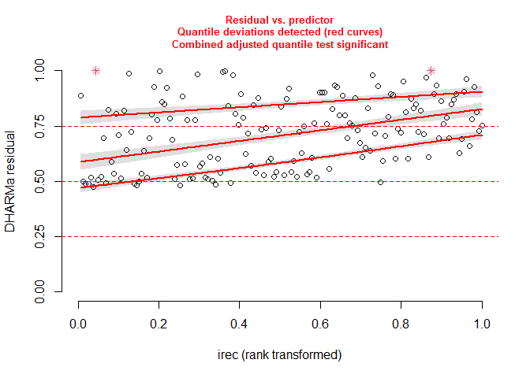

Irec and creel data exploration
================
Catarina Wor
January 2023

# Steps

- Reproduce current simple model
- compare with updated version including area

The original model is given by:

$$
Creel_i =  \beta_1\cdot z_i + \epsilon_i
$$ $$
z_i = iREC_i   + \nu_{i} 
$$

$$
\epsilon_i \sim N(0,\sigma_{\epsilon})
$$ $$
\nu_{i} \sim N(0,\sigma_{\nu})
$$

This model is run individually for each year, and disposition
(kept/released). In the initial runs of this project, I thought of
grouping all the years as replicates, however that would mean that the
catch estimates for year Y would change every time the calibration is
re-run, which is not ideal and may cause a lot of confusion.

So I am reproducing the analysis (kind of), by year. Using year 2019 as
an example here.

## Reproduce default model

This is an attempt to reproduce the original model using glmmTMB - So I
can compare it with the model with area as a covariate. The original
code is written in JAGS, and takes into account the known sd of the
observed irec estimates. – I am not sure of how to reproduce that in
glmmTMB, so I crated a dummy variable for each observation.

``` r
m <- glmmTMB(creel ~ 0+ (0+irec|dum),
             data = dat_pos)
summary(m)
```

    ##  Family: gaussian  ( identity )
    ## Formula:          creel ~ 0 + (0 + irec | dum)
    ## Data: dat_pos
    ## 
    ##      AIC      BIC   logLik deviance df.resid 
    ##   2643.0   2649.1  -1319.5   2639.0      157 
    ## 
    ## Random effects:
    ## 
    ## Conditional model:
    ##  Groups   Name Variance  Std.Dev.
    ##  dum      irec    0.8598  0.9273 
    ##  Residual      8029.8669 89.6095 
    ## Number of obs: 159, groups:  dum, 159
    ## 
    ## Dispersion estimate for gaussian family (sigma^2): 8.03e+03

``` r
#diagnostics
bm <- DHARMa::simulateResiduals(m, n = 1000)
plotResiduals(bm, form = dat_pos$irec)
```

<!-- -->

## Updated method

This update is based on Sean’s previous work on the explore.R file. To
my suprise, the best model still performs well when the data is split by
year.

``` r
dat_pos$log_irec <- log(dat_pos$irec) 

m1.2 <- glmmTMB(creel ~ 1 + log_irec +  (1 + log_irec | region), 
                data = dat_pos, family = nbinom1(), dispformula = ~log_irec)

summary(m1.2)
```

    ##  Family: nbinom1  ( log )
    ## Formula:          creel ~ 1 + log_irec + (1 + log_irec | region)
    ## Dispersion:             ~log_irec
    ## Data: dat_pos
    ## 
    ##      AIC      BIC   logLik deviance df.resid 
    ##   2293.5   2315.0  -1139.8   2279.5      152 
    ## 
    ## Random effects:
    ## 
    ## Conditional model:
    ##  Groups Name        Variance Std.Dev. Corr  
    ##  region (Intercept) 4.04994  2.0124         
    ##         log_irec    0.05131  0.2265   -0.99 
    ## Number of obs: 159, groups:  region, 12
    ## 
    ## Conditional model:
    ##             Estimate Std. Error z value Pr(>|z|)    
    ## (Intercept) -1.31538    0.77747  -1.692   0.0907 .  
    ## log_irec     1.11360    0.09348  11.912   <2e-16 ***
    ## ---
    ## Signif. codes:  0 '***' 0.001 '**' 0.01 '*' 0.05 '.' 0.1 ' ' 1
    ## 
    ## Dispersion model:
    ##             Estimate Std. Error z value Pr(>|z|)    
    ## (Intercept)  3.33831    0.64059   5.211 1.88e-07 ***
    ## log_irec     0.42311    0.08686   4.871 1.11e-06 ***
    ## ---
    ## Signif. codes:  0 '***' 0.001 '**' 0.01 '*' 0.05 '.' 0.1 ' ' 1

``` r
#diagnostics
r <- DHARMa::simulateResiduals(m1.2, n = 1000)
plot(r)
```

<!-- -->

## brms

I am trying to reproduce the model from glmmTMB in brms but unsure if
this one makes sense.

``` r
#compare models with and without the cv 
dat_pos$log_irec_cent <- dat_pos$log_irec - mean(dat_pos$log_irec)
dat_pos$irec_cv <- dat_pos$sdirec/ dat_pos$irec

fit1 <- brm(
  bf(
    creel ~   me(log_irec_cent,irec_cv) +
      (me(log_irec_cent,irec_cv) | region), 
    shape ~ log_irec_cent), 
  data = dat_pos, 
  family = negbinomial(),
  iter = 600, chains = 2, cores = 2
)
```

    ## Compiling Stan program...

    ## Start sampling

    ## Warning: There were 30 transitions after warmup that exceeded the maximum treedepth. Increase max_treedepth above 10. See
    ## https://mc-stan.org/misc/warnings.html#maximum-treedepth-exceeded

    ## Warning: Examine the pairs() plot to diagnose sampling problems

    ## Warning: The largest R-hat is 1.05, indicating chains have not mixed.
    ## Running the chains for more iterations may help. See
    ## https://mc-stan.org/misc/warnings.html#r-hat

    ## Warning: Bulk Effective Samples Size (ESS) is too low, indicating posterior means and medians may be unreliable.
    ## Running the chains for more iterations may help. See
    ## https://mc-stan.org/misc/warnings.html#bulk-ess

    ## Warning: Tail Effective Samples Size (ESS) is too low, indicating posterior variances and tail quantiles may be unreliable.
    ## Running the chains for more iterations may help. See
    ## https://mc-stan.org/misc/warnings.html#tail-ess

``` r
fit1
```

    ##  Family: negbinomial 
    ##   Links: mu = log; shape = log 
    ## Formula: creel ~ me(log_irec_cent, irec_cv) + (me(log_irec_cent, irec_cv) | region) 
    ##          shape ~ log_irec_cent
    ##    Data: dat_pos (Number of observations: 159) 
    ##   Draws: 2 chains, each with iter = 600; warmup = 300; thin = 1;
    ##          total post-warmup draws = 600
    ## 
    ## Group-Level Effects: 
    ## ~region (Number of levels: 12) 
    ##                                       Estimate Est.Error l-95% CI u-95% CI Rhat
    ## sd(Intercept)                             0.70      0.23     0.35     1.24 1.00
    ## sd(melog_irec_centirec_cv)                0.29      0.14     0.06     0.60 1.01
    ## cor(Intercept,melog_irec_centirec_cv)    -0.68      0.27    -0.98     0.08 1.01
    ##                                       Bulk_ESS Tail_ESS
    ## sd(Intercept)                              197      329
    ## sd(melog_irec_centirec_cv)                 116      206
    ## cor(Intercept,melog_irec_centirec_cv)      262      424
    ## 
    ## Population-Level Effects: 
    ##                        Estimate Est.Error l-95% CI u-95% CI Rhat Bulk_ESS
    ## Intercept                  6.21      0.23     5.68     6.61 1.00      175
    ## shape_Intercept            0.16      0.14    -0.10     0.44 1.00      364
    ## shape_log_irec_cent        0.77      0.10     0.58     0.96 1.01      318
    ## melog_irec_centirec_cv     1.19      0.12     0.96     1.44 1.01      233
    ##                        Tail_ESS
    ## Intercept                   239
    ## shape_Intercept             444
    ## shape_log_irec_cent         262
    ## melog_irec_centirec_cv      230
    ## 
    ## Draws were sampled using sampling(NUTS). For each parameter, Bulk_ESS
    ## and Tail_ESS are effective sample size measures, and Rhat is the potential
    ## scale reduction factor on split chains (at convergence, Rhat = 1).

``` r
nd1 <- expand.grid(   
  region = unique(dat_pos$region),
  log_irec_cent = seq(min(dat_pos$log_irec_cent), max(dat_pos$log_irec_cent), length.out = 100),
  irec_cv = mean(dat_pos$irec_cv))
  #seq(min(dat_pos$irec_cv), max(dat_pos$irec_cv), length.out = 100))
 

nd1$log_irec <- nd1$log_irec_cent + mean(dat_pos$log_irec)
nd1$irec <- exp(nd1$log_irec)

x1 <- tidybayes::add_linpred_draws(nd1, fit1, ndraws = 100, transform = TRUE)
  
  ggplot(data=x1) +
  geom_line(aes(irec, .linpred, group = paste(region, .draw), colour = region),alpha = 0.2) +
  geom_point(data=dat_pos,aes(x=irec,y=creel))+
  facet_wrap(~region) +
  scale_x_log10() +
  scale_y_log10()
```

    ## Warning: Transformation introduced infinite values in continuous y-axis

<!-- -->
